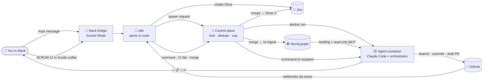

<div align="center">

# 🛠️ Code-Crafter

### _Post a ticket in Slack. Get a review-ready pull request back._ 🚀

**Your team's backlog of "small but someone has to do it" tickets, handled by an AI teammate<br/>that works in its own sandbox 📦, knows your architecture 🕸️, takes review comments 💬, and never merges without you 👀**


`🧪 working prototype` · `💸 free tiers + one Claude subscription` · `🏠 fully self-hosted` · `🔓 open source`

</div>

---

## 💥 Why this exists

Every engineering team pays the same hidden tax 💸:

- 🐌 the **"quick" tickets** (a search box, a health endpoint, a config flag, removing a dead feature) that each eat half a day of context-switching
- 🔁 the **review ping-pong**: comment, wait, fix, push, wait again
- 🧭 the **"how does this service even work?"** hour before anyone writes a line
- 📋 the **busywork around the code**: branch, PR, Jira status, Slack update, cleanup

**Code-Crafter takes all of that off your engineers' plates.** You write the ticket and review the PR. Everything in between, the typing, the checks, the fixes, the Jira moves and the Slack updates, happens on its own. 🤖

> 🧑‍💻 Engineers stop being typists and become reviewers. The backlog shrinks while they work on the hard problems.

### 📈 Real numbers from its first customer

| | |
|---|---|
| 🏆 **PRs merged** into [expense-manager](https://github.com/anandgupta193/expense-manager), all written by code-crafter | **6** |
| ⏱️ Slack message → green draft PR (a new API endpoint, [PR #14](https://github.com/anandgupta193/expense-manager/pull/14)) | **~4 minutes** |
| 💰 Model cost of that ticket (subscription equivalent) | **~$0.20** |
| 🧑‍⚖️ Human time on it | **write the ticket + review a 2-file diff** |
| 🛠️ Infra bill | **$0**: everything runs on a laptop and free tiers |

---

## 🎬 What it looks like

```text
#ops            you:  Add a GET /api/health endpoint for uptime checks …
                bot:  🎫 Created SCRUM-11 → https://…/browse/SCRUM-11

#code-crafter   you:  SCRUM-11
                bot:  👀 Picked up SCRUM-11
                      🕸️ architecture context: 15 facts, 3 doc chunks
                      📋 draft PR #14 · 💾 add GET /api/health · 💾 update context.yaml
                bot:  ✅ Done: lint ✓ format ✓ types ✓ build ✓

GitHub PR #14   you:  🟢 Approve & merge
                bot:  🎉 merged · Jira → Done · 🕸️ architecture graph updated · container cleaned up
```

That's a real run ([PR #14](https://github.com/anandgupta193/expense-manager/pull/14)). The agent even **updated the architecture manifest on its own**, because its rules say an out-of-date map is a bug. 🗺️

---

## 🤔 What exactly does it do?

Think of it as **a new developer who joins for one ticket, does it, and leaves** 👋:

1. 📦 **Gets a fresh desk:** a disposable Docker container just for that ticket
2. 🕸️ **Gets briefed:** what this service exposes, what it calls, where its data lives, and the docs most relevant to the ticket, pulled from an **architecture knowledge graph**
3. 🧠 **Does the work** with **Claude Code**, on its own branch, **committing as it goes**
4. 🔍 **Checks itself:** runs your repo's lint, format, typecheck and build, and fixes what fails
5. 📬 **Opens a draft PR** and pings you in Slack
6. 💬 **Takes feedback:** reads your review comments and CI failures, fixes them, replies in the thread. Vague comment? It **asks** instead of guessing 🙋
7. ✅ **Wraps up:** when you merge, Jira goes to **Done**, the graph re-learns the new architecture, and the container disappears

You never leave Slack and GitHub. The robot does the typing; you do the thinking. 🧑‍⚖️

---

## 🕸️ NEW: it knows your architecture (Graph RAG)

Most AI coding tools start every task **blind**: they grep around and guess. Code-Crafter starts with a **map** 🗺️.

```text
  your repo                              the graph (Neo4j)                       the agent
  ─────────                              ─────────────────                       ─────────
  .codecrafter/context.yaml ──┐  every   ┌ Service ─ EXPOSES ─▶ Endpoint         📋 briefing in its first prompt:
    endpoints, calls,         ├▶ merge ─▶├ Service ─ CALLS ───▶ ExternalService     "you're in expense-manager; it exposes
    databases, libraries      │  to main ├ Service ─ OWNS ────▶ Database            POST /api/chat, calls OpenRouter …
  docs/*.md ──────────────────┘          └ DocChunk (embedded) ─▶ Service           here are the most relevant docs"
                                                                                  🔎 live, read-only graph queries mid-task
```

- 📄 **One small YAML file per repo** (`.codecrafter/context.yaml`) describes its endpoints, outbound calls, data stores and key libraries.
- 🔁 **Self-updating:** every merge to `main` re-ingests it within seconds. Only changed doc sections are re-embedded.
- 🎯 **RAG on your docs:** the ticket text is embedded and matched against your docs with local **Ollama** (`nomic-embed-text`). Free, and this step never leaves your machine.
- 🔎 **Live lookups:** the agent can query the graph mid-task through a **read-only** Neo4j MCP server ("who calls this endpoint?").
- 🧹 **Drift is a defect:** if a change adds an endpoint, an outbound call or a data store, the agent **updates the manifest in the same PR**. A broken manifest is rejected, and #ops is told exactly what to fix.
- 🧯 **Never blocks:** if the graph is down, tickets still run, just without the briefing.

With more repos, this is what lets a ticket on service A arrive already knowing service B's API. 🤝

---

## 🗺️ How it works



### 🧩 The pieces

| | Piece | Lifetime | What it does |
|---|---|---|---|
| 📦 | **Agent container** | one per ticket, disposable | Clones the repo, gets briefed from the graph, runs Claude Code under a supervisor, opens the draft PR |
| 🧭 | **Control plane** | always on | Listens to Slack, starts and stops containers, routes GitHub feedback, keeps the graph up to date, cleans up |
| 🕸️ | **Neo4j** | always on | The architecture graph: services, endpoints, calls, data stores, libraries, embedded doc chunks |
| 🦙 | **Ollama** | on your Mac | Turns text into embeddings for doc search (free, local) |
| 🧩 | **n8n** | always on | Turns raw Slack and GitHub events into clean data; creates Jira tickets from `#ops` |
| 🗄️ | **Redis** | always on | Locks, Slack thread IDs, queued feedback for sleeping containers |
| 📡 | **smee** | always on | Carries GitHub webhooks from the internet to your laptop |

### 🧠 Where the memory lives (why a container can die at any time)

| What | Stored in | Survives a crash? |
|---|---|---|
| 💻 The code | the `CODE-CRAFTER-<KEY>` branch on GitHub | ✅ |
| 🗣️ Claude's conversation | a per-ticket Docker volume | ✅ |
| 🎛️ Locks, threads, queued comments | Redis | ✅ |
| 🧵 Link to the Slack thread | a hidden marker in the PR description | ✅ |
| 🕸️ What the system looks like | Neo4j, rebuilt from `context.yaml` on every merge | ✅ |

A new container clones the branch, reloads the conversation and **carries on where the last one stopped**. ♻️

---

## ✨ Features

- 🎫 **Slack → Jira:** any message in `#ops` becomes a Jira Story, and the link comes straight back in the thread.
- 🚀 **Slack → PR:** post `SCRUM-11`, or the Jira link, in the code-crafter channel and a draft PR shows up minutes later.
- 🕸️ **Architecture-aware:** every ticket starts with a briefing from the knowledge graph, and the agent can query the graph live (read-only).
- 🧪 **Trust, but verify:** the orchestrator re-runs your repo's own checks and gives the agent up to 2 fix rounds.
- 💬 **Review loop:** inline comments go to the agent, which fixes them, replies in the thread, and pushes.
- 🧹 **Comment triage:** never redoes feedback it already handled, and works on CI failures and change requests first.
- 🔴 **CI loop:** a failed CI run on the latest commit becomes a "fix the pipeline" task; failures on older commits are skipped.
- 😴 **Sleeps when idle:** containers exit after 40 idle minutes; the next comment wakes them up and they resume the same session.
- 🛑 **Guardrails:** PRs stay **draft** until *you* say so, Jira only moves **forward**, the agent never touches CI files, and nothing merges without a human.
- 🕹️ **Remote control:** comment `/codecrafter pause | resume | stop | approve` on the PR.
- 🔌 **Tool-agnostic:** Claude Code sits behind an `AgentRunner` interface, so a Cursor adapter can be dropped in.
- 🧯 **Never silent:** a crash posts ❌ with the reason to the Slack thread.
- 📊 **Status page** at `localhost:3000/status`: health lights (Slack · n8n · smee · Redis · **Graph**), every ticket's state (crashed first), live logs with secrets redacted, and PRs merged so far.

---

## 🏢 Who is this for?

- 🧑‍🤝‍🧑 **Small teams** with more tickets than hands
- 🏗️ **Platform teams** who want a safe, self-hosted pattern for AI coding agents instead of giving a bot the keys to everything
- 🧪 **Engineers curious how "AI teammates" really work**: every piece is small, readable TypeScript with tests, and the [docs](docs/) explain each decision

---

## 🏁 Quick start

> 📋 You'll need: Docker, Node 24, a GitHub **bot account**, Jira Cloud (free), a Slack workspace (free), a Claude Pro/Max subscription or API key, and [Ollama](https://ollama.com) for the graph. The full checklist is in [docs/01](docs/01-accounts-and-infra.md).

```bash
# 1️⃣  secrets
cp .env.example .env            # fill it in (docs/01). INTERNAL_API_TOKEN, NEO4J_PASSWORD: openssl rand -hex 16
claude setup-token              # → CLAUDE_CODE_OAUTH_TOKEN in .env

# 2️⃣  embeddings (once)
brew install ollama && brew services start ollama
ollama pull nomic-embed-text

# 3️⃣  build + start
docker volume create n8n_data   # first time only
docker compose build agent      # the per-ticket agent image
docker compose up -d            # n8n · redis · smee · neo4j · control-plane
scripts/n8n-import.sh           # load + publish the n8n workflows from git

# 4️⃣  seed the graph (after adding .codecrafter/context.yaml to your repo)
curl -X POST localhost:3000/api/context/reindex/<service> -H "x-codecrafter-token: $INTERNAL_API_TOKEN"

# 5️⃣  go
#   post a feature idea in #ops          → 🎫 Jira ticket
#   post the ticket key in #code-crafter → 🚀 draft PR

# 6️⃣  watch
open http://localhost:3000/status   # health · tickets · logs · PR stats
open http://localhost:7474          # 🕸️ explore the graph (user: neo4j)
```

🧰 Want to skip Slack while you tinker? `scripts/run-ticket.sh SCRUM-8` starts a ticket container by hand and follows its logs.

---

## 📝 Teach it your repo

### `codecrafter.yaml`: how to build and check it

```yaml
system:
  setup:
    volta: { enabled: true, node: '24' }
    command: 'npm'
    args: ['ci']
codecrafter:
  agent:
    provider: claude        # claude today · cursor tomorrow
    model: haiku            # per ticket: Jira label model:sonnet / model:opus
    fallback: []
    on_usage_limit: pause   # checkpoint, post the reset time, never downgrade mid-ticket
  pull_request:
    draft: true
  commands:                 # what "done" means for this repo
    lint: 'npm run lint'
    format: 'npm run format:check'
    typecheck: 'npx tsc --noEmit'
    build: 'npm run build'
```

### `.codecrafter/context.yaml`: what it looks like from the outside

```yaml
service: expense-manager
repo: https://github.com/anandgupta193/expense-manager.git
description: Personal expense tracker with an AI chat assistant.
exposes:
  - { method: POST, path: /api/chat, handler: app/api/chat/route.ts, auth: firebase-id-token }
calls:
  - { service: openrouter, external: true, purpose: 'Chat LLM', env: [OPENROUTER_API_KEY] }
databases:
  - { name: firestore, kind: firestore, collections: [expenses, categories, spenders, settings] }
libraries:
  - { name: '@google/adk', why: 'chat agent runtime (tools, sessions, streaming)' }
docs: [docs/architecture.md, docs/data-model.md]
```

The full example is in [expense-manager](https://github.com/anandgupta193/expense-manager/blob/main/.codecrafter/context.yaml). 💡 Quote any value that contains a comma; the ingester rejects unquoted ones and tells you exactly where.

🏷️ **Jira labels:** `model:opus` for a hard ticket · `plan-first` to approve the plan before any code gets written.

---

## 🗂️ What's in the box

```text
code-crafter/
├── 📦 agent/                  the per-ticket worker
│   ├── Dockerfile             Node 24 · git · gh · Claude Code · Neo4j MCP server
│   ├── scripts/entrypoint.sh  clone → branch → harness → MCP config → orchestrator
│   ├── rules/code-crafter.md  the agent's house rules
│   └── orchestrator/          prompt · 🕸️ context briefing · supervision · guardrails · checks · command queue
├── 🧭 control-plane/          Slack bridge · spawner · GitHub event router · 🕸️ graph ingestion · reaper · status page
├── 🧩 n8n/                    tested parsers → generated workflows
├── ⚙️ config/services.yaml    which repos it may touch
├── 💬 slack/manifest.yaml     one-paste Slack app
├── 🐳 docker-compose.yml      the always-on stack (incl. Neo4j)
└── 📚 docs/                   the full architecture, piece by piece
```

🧪 **Tests:** 44 agent · 53 control plane · 15 parser. Run `npm test` in each package, and `node --test n8n/parsers/*.test.js`.

---

## 🛡️ Safety notes

- 🤖 The agent pushes as a **separate GitHub bot** with minimal scopes: it can open PRs but **can't merge**, can't change CI, and isn't an admin.
- 🔒 Branch protection on `main`: PR + 1 human approval + green CI.
- 🕸️ The agent's graph access is **read-only** twice over: the MCP server has no write tool, and Neo4j itself refuses writes in read-only sessions.
- 🔐 Secrets live only in `.env` (gitignored), and the logs and status page redact them. Pushes are secret-scanned by hand today; an automatic gitleaks hook is coming in 1d.
- ⚠️ **Prototype:** inside its container the agent currently gets the full set of tokens. Tighten this (see [docs/12](docs/12-security.md)) before letting untrusted people post tickets or comments.

---

## 🧭 Roadmap

| | Phase | Status |
|---|---|---|
| 📦 | **1a** Agent in a container → draft PR | ✅ |
| 🔌 | **0/1b** Slack → n8n → control plane → spawn | ✅ |
| 💬 | **1c** Review comments, CI failures, merge → Done | ✅ |
| 🧹 | **Comment triage**: skip handled feedback, most important first | ✅ |
| 📊 | **Status page**: health, tickets, logs, PR stats | ✅ |
| 🎫 | **#ops → Jira** ticket creation | ✅ |
| 🕸️ | **2** Architecture knowledge graph: Neo4j + Graph RAG briefing + live MCP + self-updating manifest | ✅ verified end to end |
| 🧯 | **1d** Catch-up poll, auto-resume, webhook signatures, gitleaks, Slack alerts | 🚧 next |
| 🔀 | **2b** Cursor adapter | 🔮 |
| 🗺️ | **3** Multi-repo planner: one request → N PRs, planned from the graph | 🔮 |
| ☸️ | **4–5** Kubernetes + cloud | 🔮 |

---

## 📚 Docs

| | Doc | |
|---|---|---|
| 🧭 | [00 · Overview](docs/00-overview.md) | the big picture |
| 💳 | [01 · Accounts & infra](docs/01-accounts-and-infra.md) | what to sign up for, install, pay for |
| 💬 | [02 · Trigger intake](docs/02-trigger-intake.md) | Slack → ticket → spawn |
| 🧩 | [03 · Event bus](docs/03-event-bus-n8n.md) | n8n workflows and parsers |
| 🚢 | [04 · Spawner](docs/04-spawner.md) | one container per ticket |
| 📦 | [05 · Agent runtime](docs/05-agent-runtime.md) | image, boot, `codecrafter.yaml` |
| 🔌 | [06 · AgentRunner](docs/06-agent-runner-abstraction.md) | Claude / Cursor adapters |
| 🧠 | [07 · Orchestrator](docs/07-orchestrator.md) | prompt, supervision, guardrails |
| 🗄️ | [08 · State & memory](docs/08-state-and-memory.md) | why containers can die |
| 🔁 | [09 · Feedback & merge](docs/09-feedback-and-merge.md) | comments, CI, merge → Done |
| 🕸️ | [10 · Context graph](docs/10-context-graph.md) | architecture memory: Neo4j, Graph RAG, MCP |
| 🗺️ | [11 · Planner](docs/11-planner.md) | *(later)* multi-repo plans |
| 🛡️ | [12 · Security](docs/12-security.md) | secrets, tokens, sandboxing |
| 🧭 | [13 · Roadmap](docs/13-roadmap.md) | phases and the decisions log |
| 🎯 | [14 · Target repo](docs/14-target-repo-expense-manager.md) | the first repo it works on |
| 🤖 | [15 · Bot account](docs/15-bot-account-setup.md) | GitHub bot, token, branch protection |
| 📋 | [16 · Plan 1c + 1d](docs/16-plan-1c-1d.md) | finishing the loop, hardening |
| 📊 | [17 · Status page](docs/17-status-page.md) | what broke and why |

---

## 💡 Inspiration

Based on the published architecture of QuillBot's internal **Code-Crafter** (disposable pod per ticket, n8n event bus, PR-event feedback loop, Neo4j context graph), rebuilt from scratch with GitHub, Slack Socket Mode, local Docker, Ollama and free tiers.

<div align="center">

### 🧑‍💻 Built by [@anandgupta193](https://github.com/anandgupta193)

_First customer: [expense-manager](https://github.com/anandgupta193/expense-manager), where 6 merged PRs and counting were written by this robot_ 🤖💸

### ⭐ If this saved you an afternoon, or just made you think "wait, we could do this", **star the repo** ⭐

_Stars tell me which phase to build next. Issues and ideas are very welcome._ 🙌

</div>
