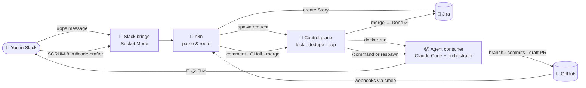

<div align="center">

# 🛠️ Code-Crafter

### _Post a ticket in Slack. Get a pull request back._ 🚀

**An AI coding agent that turns Jira tickets into reviewed, CI-green GitHub pull requests.<br/>Every ticket gets its own disposable sandbox 📦, and you stay the reviewer 👀**


`🧪 working prototype` · `💸 runs on free tiers + a Claude subscription` · `🏠 self-hosted on your laptop`

</div>

---

## 🤔 What is this?

Code-Crafter is **a factory for pull requests** 🏭.

You describe a change in Slack. It becomes a Jira ticket. You say "go", and Code-Crafter:

1. 📦 spins up a **fresh Docker container** just for that ticket
2. 🧠 runs **Claude Code** inside it, with the ticket, the repo and a set of house rules
3. 🌿 writes the code on its own branch, **committing as it goes**
4. 🔍 runs **lint, format, typecheck and build** itself, and fixes what fails
5. 📬 opens a **draft PR** and pings you in Slack
6. 💬 reads **your review comments**, fixes them, and replies in the thread
7. ✅ when you merge, it moves Jira to **Done** and cleans up after itself

You never leave Slack and GitHub. The robot does the typing; you do the thinking. 🧑‍⚖️

---

## 🎬 The 30-second demo

```text
#ops                 you:  Add a search box to the Expenses page
                           - filters by description or notes …
                     bot:  🎫 Created SCRUM-8 → https://…/browse/SCRUM-8

#code-crafter        you:  SCRUM-8
                     bot:  👀 Picked up SCRUM-8 · container code-crafter-scrum-8
                     bot:  🚀 started · 📋 draft PR #8 · 💾 SCRUM-8: add search box
                     bot:  ✅ Done — PR #8 is ready for your review (lint ✓ format ✓ types ✓ build ✓)

GitHub PR #8         you:  "Search expenses" would be a better placeholder
                     bot:  Updated! Changed the placeholder …   (+ new commit, checks green)

                     you:  🟢 Merge
                     bot:  🎉 merged · Jira → Done · container cleaned up
```

Real run on [expense-manager#8](https://github.com/anandgupta193/expense-manager/pull/8), about 4 minutes from Slack message to green draft PR. ⏱️

---

## 🗺️ How it works



### 🧩 The pieces

| | Piece | Lifetime | What it does |
|---|---|---|---|
| 📦 | **Agent container** | one per ticket, disposable | Clones the repo, builds its toolchain, runs Claude Code under a supervisor, opens the draft PR |
| 🧭 | **Control plane** | always on | Listens to Slack, starts and stops containers, routes GitHub feedback, cleans up |
| 🧩 | **n8n** | always on | Turns raw Slack and GitHub events into clean data; creates Jira tickets from `#ops` |
| 🗄️ | **Redis** | always on | Locks, Slack thread IDs, queued feedback for sleeping containers |
| 📡 | **smee** | always on | Carries GitHub webhooks from the internet to your laptop |

### 🧠 Where the memory lives (why a container can die at any time)

| What | Stored in | Survives a crash? |
|---|---|---|
| 💻 The code | the `CODE-CRAFTER-<KEY>` branch on GitHub | ✅ |
| 🗣️ Claude's conversation | a per-ticket Docker volume | ✅ |
| 🎛️ Locks, threads, queued comments | Redis | ✅ |
| 🧵 Link to the Slack thread | a hidden marker in the PR description | ✅ |

A new container clones the branch, reloads the conversation and **carries on where the last one stopped**. ♻️

---

## ✨ Features

- 🎫 **Slack → Jira:** any message in `#ops` becomes a Jira Story (title = first line) and the link comes straight back in the thread.
- 🚀 **Slack → PR:** post `SCRUM-8`, or the Jira link, in the code-crafter channel and a draft PR shows up minutes later.
- 🧪 **Trust, but verify:** the orchestrator re-runs your repo's own checks itself and gives the agent up to 2 fix rounds.
- 💬 **Review loop:** inline comments go to the agent, which fixes them, replies in the thread, and pushes. Vague comment? It **asks you** instead of guessing. 🙋
- 🔴 **CI loop:** a failed CI run on the latest commit becomes a "fix the pipeline" task.
- 😴 **Sleeps when idle:** containers exit after 40 idle minutes; the next comment wakes them up and they resume the same session.
- 🛑 **Guardrails:** PRs stay **draft** until *you* say so, Jira only moves **forward**, the agent never touches CI files, and nothing merges without a human.
- 🕹️ **Remote control:** comment `/codecrafter pause | resume | stop | approve` on the PR.
- 🔌 **Tool-agnostic:** Claude Code sits behind an `AgentRunner` interface, so a Cursor adapter can be dropped in.
- 🧯 **Never silent:** a crash posts ❌ with the reason to the Slack thread.
- 📊 **Status page** at `localhost:3000/status`: service health, every ticket's state (crashed first), live-ish logs with secrets redacted, and how many PRs code-crafter has merged.

---

## 🏁 Quick start

> 📋 You'll need: Docker, Node 24, a GitHub **bot account**, Jira Cloud (free), a Slack workspace (free), and a Claude Pro/Max subscription or API key. The full checklist is in [docs/01](docs/01-accounts-and-infra.md).

```bash
# 1️⃣  secrets
cp .env.example .env            # fill it in (docs/01), INTERNAL_API_TOKEN: openssl rand -hex 24
claude setup-token              # → CLAUDE_CODE_OAUTH_TOKEN in .env

# 2️⃣  build + start
docker volume create n8n_data   # first time only
docker compose build agent      # the per-ticket agent image
docker compose up -d            # n8n · redis · smee · control-plane
scripts/n8n-import.sh           # load + publish the n8n workflows from git

# 3️⃣  go
#   post a feature idea in #ops         → 🎫 Jira ticket
#   post the ticket key in #code-crafter → 🚀 draft PR
```

🧰 Want to skip Slack while you tinker? `scripts/run-ticket.sh SCRUM-8` starts a ticket container by hand and follows its logs.

---

## 📝 Teach it your repo: `codecrafter.yaml`

Drop this in the root of any target repo:

```yaml
system:
  setup:
    volta: { enabled: true, node: '24' }
    command: 'npm'
    args: ['ci']
codecrafter:
  agent:
    provider: claude        # claude today · cursor tomorrow
    model: haiku            # per ticket: Jira label model:sonnet / model:opus
    fallback: []
    on_usage_limit: pause   # checkpoint, post the reset time, never downgrade mid-ticket
  pull_request:
    draft: true
  commands:                 # what "done" means for this repo
    lint: 'npm run lint'
    format: 'npm run format:check'
    typecheck: 'npx tsc --noEmit'
    build: 'npm run build'
```

🏷️ **Jira labels:** `model:opus` for a hard ticket · `plan-first` to approve the plan before any code gets written.

---

## 🗂️ What's in the box

```text
code-crafter/
├── 📦 agent/                  the per-ticket worker
│   ├── Dockerfile             Node 24 · git · gh · Claude Code
│   ├── scripts/entrypoint.sh  clone → branch → harness → orchestrator
│   ├── rules/code-crafter.md  the agent's house rules
│   └── orchestrator/          prompt · supervision · guardrails · checks · command queue
├── 🧭 control-plane/          Slack bridge · spawner · GitHub event router · reaper
├── 🧩 n8n/                    tested parsers → generated workflows
├── ⚙️ config/services.yaml    which repos it may touch
├── 💬 slack/manifest.yaml     one-paste Slack app
├── 🐳 docker-compose.yml      the always-on stack
└── 📚 docs/                   the full architecture, piece by piece
```

🧪 Tests: 26 agent · 27 control plane · 15 parser. Run `npm test` in each package, and `node --test n8n/parsers/*.test.js`.

---

## 🛡️ Safety notes

- 🤖 The agent pushes as a **separate GitHub bot** with minimal scopes: it can open PRs but **can't merge**, can't change CI, and isn't an admin.
- 🔒 Branch protection on `main`: PR + 1 human approval + green CI.
- 🔐 Secrets live only in `.env` (gitignored). Pushes are secret-scanned by hand today; an automatic gitleaks hook is coming in 1d.
- ⚠️ **Prototype:** inside its container the agent currently gets the full set of tokens. Tighten this (see [docs/12](docs/12-security.md)) before letting untrusted people post tickets or comments.

---

## 🧭 Roadmap

| | Phase | Status |
|---|---|---|
| 📦 | **1a** Agent in a container → draft PR | ✅ |
| 🔌 | **0/1b** Slack → n8n → control plane → spawn | ✅ |
| 💬 | **1c** Review comments, CI failures, merge → Done | ✅ verified live (CI-failure path pending) |
| 🎫 | **#ops → Jira** ticket creation | ✅ |
| 🧯 | **1d** Catch-up poll, auto-resume, webhook signatures, gitleaks | 🚧 next |
| 🕸️ | **2** Architecture knowledge graph (Neo4j) in the prompt | 🔮 |
| 🔀 | **2b** Cursor adapter | 🔮 |
| 🗺️ | **3** Multi-repo planner: one request → N PRs | 🔮 |
| ☸️ | **4–5** Kubernetes + cloud | 🔮 |

---

## 📚 Docs

| | Doc | |
|---|---|---|
| 🧭 | [00 · Overview](docs/00-overview.md) | the big picture |
| 💳 | [01 · Accounts & infra](docs/01-accounts-and-infra.md) | what to sign up for, install, pay for |
| 💬 | [02 · Trigger intake](docs/02-trigger-intake.md) | Slack → ticket → spawn |
| 🧩 | [03 · Event bus](docs/03-event-bus-n8n.md) | n8n workflows and parsers |
| 🚢 | [04 · Spawner](docs/04-spawner.md) | one container per ticket |
| 📦 | [05 · Agent runtime](docs/05-agent-runtime.md) | image, boot, `codecrafter.yaml` |
| 🔌 | [06 · AgentRunner](docs/06-agent-runner-abstraction.md) | Claude / Cursor adapters |
| 🧠 | [07 · Orchestrator](docs/07-orchestrator.md) | prompt, supervision, guardrails |
| 🗄️ | [08 · State & memory](docs/08-state-and-memory.md) | why containers can die |
| 🔁 | [09 · Feedback & merge](docs/09-feedback-and-merge.md) | comments, CI, merge → Done |
| 🕸️ | [10 · Context graph](docs/10-context-graph.md) | *(later)* architecture memory |
| 🗺️ | [11 · Planner](docs/11-planner.md) | *(later)* multi-repo plans |
| 🛡️ | [12 · Security](docs/12-security.md) | secrets, tokens, sandboxing |
| 🧭 | [13 · Roadmap](docs/13-roadmap.md) | phases and the decisions log |
| 🎯 | [14 · Target repo](docs/14-target-repo-expense-manager.md) | the first repo it works on |
| 🤖 | [15 · Bot account](docs/15-bot-account-setup.md) | GitHub bot, token, branch protection |
| 📋 | [16 · Plan 1c + 1d](docs/16-plan-1c-1d.md) | finishing the loop, hardening |
| 📊 | [17 · Status page](docs/17-status-page.md) | what broke and why |

---

## 💡 Inspiration

Based on the architecture of QuillBot's internal **Code-Crafter** (disposable pod per ticket, n8n event bus, a feedback loop driven by PR events), rebuilt from scratch with GitHub, Slack Socket Mode, local Docker and free tiers.

<div align="center">

### 🧑‍💻 Built by [@anandgupta193](https://github.com/anandgupta193)

_First customer: [expense-manager](https://github.com/anandgupta193/expense-manager), whose features are now partly written by this robot_ 🤖💸

⭐ **Star it if you like robots that open PRs!** ⭐

</div>
